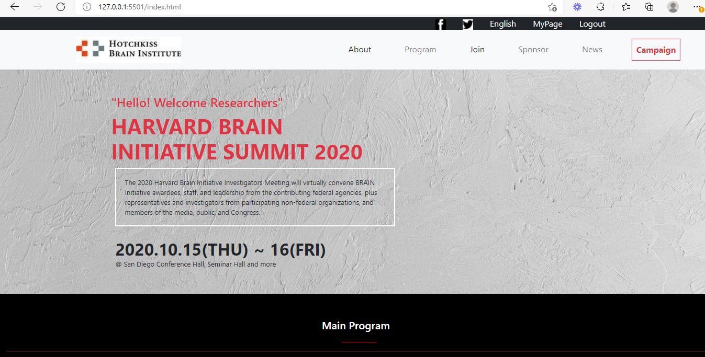

# Final Capstone Project

> The goal of this project is to design the given website design using all the tools learnt during the first four weeks. Javascript DOM manipulation is implemented and both home and about pages are implemented.

Additional description about the project and its features.

## Built With

- HTML, CSS, Javascript
- Visual Studio
- HTML, CSS, Bootstrap

## Video Link for the Project
https://www.loom.com/share/891b596532cd449ba86c018d06f6772c

## Live Demo

[Live Demo Link](https://medini-rajendra.github.io/CapstoneProject/)

#### Setup 
- git clone https://github.com/Medini-Rajendra/CapstoneProject.git
- cd into the folder
- git checkout work_branch
- open `index.html` with live server

## Authors

**Rajendra Medini**
- GitHub: [@Medini-Rajendra](https://github.com/Medini-Rajendra)
- Twitter: [@invenire512](https://twitter.com/invenire512)
- LinkedIn: [LinkedIn](https://www.linkedin.com/in/medinichaitanya/)

## License

This project is [MIT](./MIT.md) licensed.
